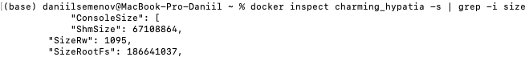
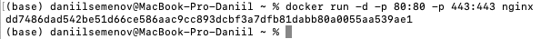
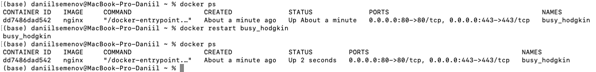
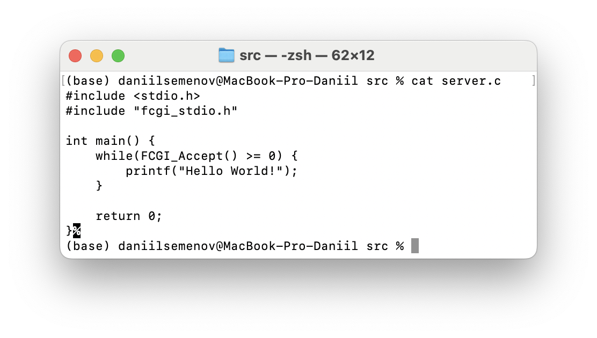
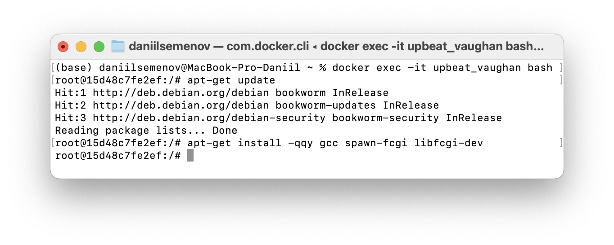

## Part 1. Готовый докер

- **Взяли официальный докер образ с nginx и выкачали его при помощи `docker pull`**

- **Проверили наличие докер образа через `docker images`**

- **Запустили докер образ через `docker run -d [image_id|repository]`**

> **-d:** это флаг, который указывает Docker на запуск контейнера в фоновом режиме (detached mode).
>

- **Проверили, что образ запустился через `docker ps`**

- **Посмотрели информацию о контейнере через `docker inspect [container_id|container_name`**

- **По выводу команды определили**

**Размер контейнера**

**Список замапленных портов**

**Ip контейнера**

- **Остановили докер образ через `docker stop [container_id|container_name]`**

- **Проверили, что образ остановился через `docker ps`**

- **Запустили докер с портами 80 и 443 в контейнере, замапленными на такие же порты на локальной машине, через команду `run`**

- **Проверили, что в браузере по адресу *localhost:80* доступна стартовая страница `nginx`**

- **Перезапустили докер контейнер через `docker restart [container_id|container_name]` и проверили, что контейнер запустился**

---

## Part 2. Операции с контейнером

- **Прочитали конфигурационный файл `nginx.conf` внутри докер контейнера через команду `exec`**

- **Создали на локальной машине файл `nginx.conf`**
`nano nginx.conf`

- **Настроили в нем по пути `/status` отдачу страницы статуса сервера `nginx`**

>Важная пометка: Была закомментированная строка
>#include /etc/nginx/conf.d/*.conf 
>для отключения default.conf

- **Скопировали созданный файл `nginx.conf` внутрь докер образа через команду `docker cp`**

- **Перезапустили `nginx` внутри докер образа через команду `exec`**

>-it: Эти опции задают интерактивный и терминальный режим выполнения команды.
>-s reload: Эта часть команды передает сигнал NGINX для перезагрузки конфигурации без остановки сервера.

- **Проверили, что по адресу `localhost:80/status` отдается страничка со статусом сервера `nginx`**

- **Экспортировали контейнер в файл `container.tar` через команду `export`**

- **Остановили контейнер**

- **Удалили образ через `docker rmi [image_id|repository]`, не удаляя перед этим контейнеры**

- **Удалили остановленный контейнер**

- **Импортировали контейнер обратно через команду `import`**

>-c: Это опция для команды docker import, которая позволяет вам указать конкретную конфигурацию при создании образа.
>Команда "nginx -g daemon off;" используется для запуска NGINX в контейнере и настроивает его на работу.

- **Запустили импортированный контейнер**

- **Проверили, что по адресу `localhost:80/status` отдается страничка со статусом сервера `nginx`**

## Part 3. Операции с контейнером
- **Написали мини сервер на C и FastCgi, который будет возвращать простейшую страничку с надписью Hello World!**

- **Написали свой nginx.conf, который будет проксировать все запросы с 81 порта на 127.0.0.1:8080**

- **Запустили контейнер из образа nginx на порту 81, переместили необходимые файлы (nginx.conf и server.c)**

> Через команду sudo exec -it [container] bash зашли в терминал.
> Обновили конфигурацию apt-get update
> Утановили все необходимые пакеты. apt-get install -qqy gcc spawn-fcgi libfcgi-dev
> Флаг -y: без разрешения скачивать пакет (always yes)
> Флаг -qq: подавляет вывод информации.

- **Запустить написанный мини сервер через spawn-fcgi на порту 8080**

- **Обновили конфигурацию nginx внутри контейнера**

- **Проверили, что в браузере по localhost:81 отдается написанная вами страничка**

## Part 4. Свой докер

**Написали свой докер образ, который:**
**1) собирает исходники мини сервера на FastCgi из Части 3**
**2) запускает его на 8080 порту**
**3) копирует внутрь образа написанный ./nginx/nginx.con**
**4) запускает nginx.**

- **Собрали написанный докер образ через docker build при этом указав имя и тег**

- **Проверили через docker images, что все собралось корректно**

- **Запустили собранный докер образ с маппингом 81 порта на 80 на локальной машине и маппингом папки ./nginx внутрь контейнера по адресу, где лежат конфигурационные файлы nginx'а (см. Часть 2)**

- **Проверили, что по localhost:80 доступна страничка написанного мини сервера**

- **Дописали в ./nginx/nginx.conf проксирование странички /status, по которой надо отдавать статус сервера nginx**

- **Перезапустили докер образ**

- **Проверили, что теперь по localhost:80/status отдается страничка со статусом nginx**

## Part 5. Свой докер

- **Dockerfile из задания 4**

- **Просканировали образ из предыдущего задания через `dockle [image_id|repository]`**

- **Исправили образ так, чтобы при проверке через dockle не было ошибок и предупреждений**

- **Dockerfile итоговый:**

- **Пояснение**

> -i CIS-DI-0010 мы игнорируем эту ошибку, т.к. наш dockerfile не имеет важных переменных. 

> rm -rf /var/lib/apt/lists - Удаление устаревших библиотек.

> rm -f /usr/bin/umount /usr/sbin/unix_chkpwd /usr/bin/chage /usr/bin/expiry /usr/bin/newgrp /usr/bin/passwd /usr/bin/chsh /usr/bin/su /usr/bin/chfn /usr/bin/mount /usr/bin/gpasswd /usr/bin/wall - Данная команда удаляет setuid и setgid файлы, которые нужны для управления системой от root. В данном задании они нам не нужны

> USER nginx устанавливаем пользователя

> Инструкция HEALTHCHECK NONE отключает мониторинг состояния контейнера.

## Part 6. Базовый Docker Compose

- **Написали файл docker-compose.yml, с помощью которого:**

	- Подняли докер контейнер из Части 5 (он должен работать в локальной сети, т.е. не нужно использовать инструкцию EXPOSE и мапить порты на локальную машину)
		
	- Подняли докер контейнер с nginx, который будет проксировать все запросы с 8080 порта на 81 порт первого контейнера

- **Замапить 8080 порт второго контейнера на 80 порт локальной машины**

> Запись вида [::]:8080 - означает, что мы принимаем любые забросы на порт 8080. В том числе с разных IP адрессов. 

- **Исполняемый файл для 1-го контейнера**

- **Исполняемый файл для 2-го контейнера**

> Вы могли заметить, что мы добавили цикл. Это сделано для того, чтобы сервер не завершался после выполнения скрипта.

- **Остановили все запущенные контейнеры**

- **Собрали и запустили проект с помощью команд `docker-compose build` и `docker-compose up`**

- **Проверили, что в браузере по *localhost:80* отдается написанная страничка, как и ранее**

- **Пояснение. Ряд файлов претерпели изменения из 5-го задания:**

>chown -R nginx:nginx /etc/nginx/nginx.conf; - Необходимо, чтобы user nginx, мог взаимодействовать с nginx.conf

>chown -R nginx:nginx /var/cache/nginx; - Необходимо, чтобы user nginx, мог изменять кэш

>chown -R nginx:nginx /home; - Необходимо, чтобы user nginx, мог работать с home

>touch /var/run/nginx.pid; 
chown -R nginx:nginx /var/run/nginx.pid; - Необходимо, чтобы user nginx, мог присваивать PID